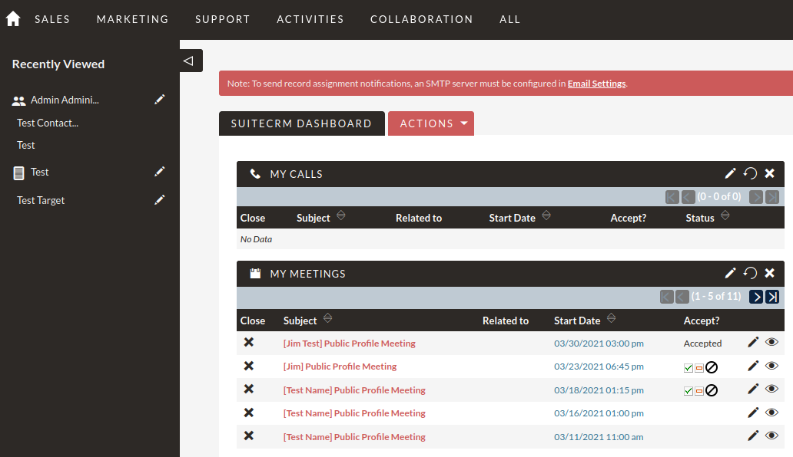
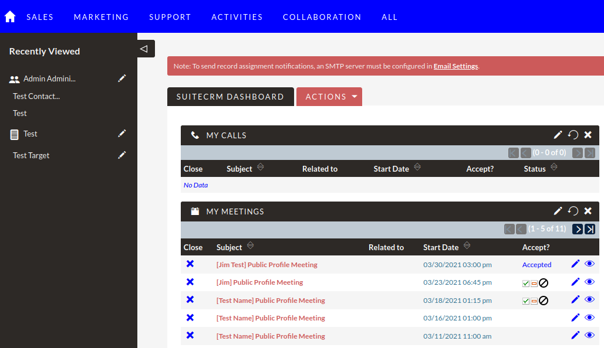

# Maricopa Community Colleges Custom SuiteCRM Theme Customisation Instructions
- Jim Mackin - jim.mackin@salesagility.com

## Introduction
The Maricopa theme is a custom subtheme of the SuiteP theme. This allows slight tweaks to colours, fonts, e.t.c. without building a completely new theme from scratch.

This file documents making some simple changes to the subtheme in order to change some of the colours, layout, e.t.c.

## Changing the Theme

Changes to the subtheme can be made by altering files in the `themes/SuiteP/css/ASSIST/` folder.

Note that changes should be made locally in a test or development environment first and the changed files should then be pushed live either via version control or using the SuiteCRM module loading system. Changing files (even just theme files) on a live environment isn't recommended.

Notably the two following files should cover the majority of changes needed:

- `themes/SuiteP/css/ASSIST/color-palette.scss` allows changing the various colours used throughout the CRM. Unfortunately, the out of the box theme has poorly named colour variables meaning this can be trial and error. The ASSIST subtheme has some additional comments added to help identify key variables to change.
- `themes/SuiteP/css/ASSIST/variables.scss` - used for more generic changes such as padding and which colour variables are applied to which elements.

Let's look at a specific example. If we wanted to change the colour of the top bar as seen in figure 1.

We would open `themes/SuiteP/css/ASSIST/color-palette.scss` and alter `color-7` (The comment above tells us this is the top bar background). Let's change it to blue. We can alter the value of `color-7` to `#0000ff`.

Once these changes are made above we will need to compile the SASS changes above into CSS. Any SASS compiler should work but we can use scssphp:

From with the CRM root run the following command:

`
./vendor/bin/pscss -f compressed themes/SuiteP/css/ASSIST/style.scss > \themes/SuiteP/css/ASSIST/style.css
`

> Note: If the pscss file doesn't exist try installing it via composer:
> `composer require leafo/scssphp`

This will package up our changes into the `style.css` file that will then be used by SuiteCRM. Finally we run a quick repair and rebuild within SuiteCRM to clear it's cache.

You can then check your changes to confirm that they are as you expect. You may need to clear/disable your browser cache in order to see your changes. If you have followed along you should see the changes reflected on the top bar, as seen in figure 2.

You'll notice here that other parts of the CRM have also changed. Generally we want to change colours on a high level - the "main" colour, or accents e.t.c. so this is fine as we want general look and feel changes.

For more in depth changes or to decouple colours changes can be made to `themes/SuiteP/css/ASSIST/variables.scss` to do so but this is usually unnecessary.

Please see https://docs.suitecrm.com/blog/customizing-subthemes/ for more in depth details.
